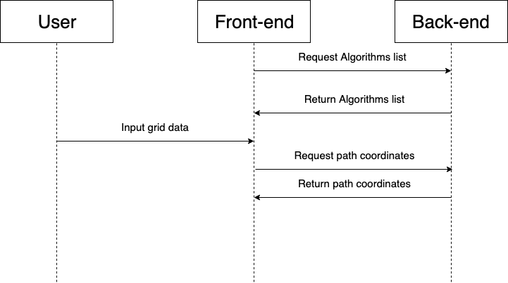

# Path Finder

A proof of concept path finding application.

Create points on a grid and see the paths between them according to different search algorithms.


### Instructions

1. Choose the dimensions for your grid.
2. Set your start and end points.
3. Set some obstacles.
4. Choose your search algorithm.
5. Click ```See Path``` and see the path from your start point to your end point according to the selected algorithm.

See it in action [here](http://francislawlor-pathfinder.herokuapp.com/). (Give it a minute to wake up. Heroku apps sleep when they are not in use!)


### Run with docker-compose

```
>docker-compose build
>docker-compose up
```

### Interaction Diagram


